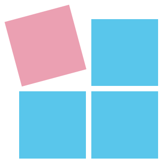
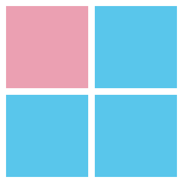

<!-- README.md is generated from README.Rmd. Please edit the .Rmd file. -->

```{r preamble, include = FALSE}
## Packages: ----- 

library(rmarkdown)
library(knitr)
# library(rmdformats)
# library(tidyverse)
# library(here)

# Own packages: 
library(unikn)
library(ds4psy)

## Housekeeping: -----

# here()
fileName <- "README.Rmd"

## Global options: ----- 

knitr::opts_chunk$set(
  collapse = TRUE,
  comment = "#>"
)
```

```{r define-URLs-i2ds-260506, echo = FALSE, eval = TRUE}
# URLs:

# URLs:
url_R    <- "https://www.r-project.org"
url_CRAN <- "https://cran.r-project.org/"

# uni.kn:
url_ilias <- "https://ilias.uni-konstanz.de"
url_zeus <- "https://zeus.uni-konstanz.de"
# ADILT: 
url_ADILT    <- "https://www.uni-konstanz.de/adilt/"
url_ADILT_en <- "https://www.uni-konstanz.de/en/adilt/"

# Posit software products:
url_RStudio   <- "https://posit.co/products/open-source/rstudio/" 
url_RMarkdown <- "https://rmarkdown.rstudio.com"
url_RMarkdown_cheatsheet <- "https://raw.githubusercontent.com/rstudio/cheatsheets/main/rmarkdown-2.0.pdf"

# (1) ds4psy: ------ 
url_ds4psy_book_old <- "https://bookdown.org/hneth/ds4psy/" # moved to:
url_ds4psy_book     <- "https://hneth-ds4psy.share.connect.posit.cloud/"
url_ds4psy_cran     <- "https://CRAN.R-project.org/package=ds4psy"

# (2) i2ds: ------ 
url_i2ds_book_old <- "https://bookdown.org/hneth/i2ds/" # moved to: 
url_i2ds_book     <- "https://hneth-i2ds.share.connect.posit.cloud/"


# (3) Current course links: ------

# Current course links: Spring/Summer 2026: ---- 

# i2ds 1: Basics (PSY-16620)
# Dates:                   Room:
# 24.04.2026:			         was C422, now: C424  
# 25.04.2026 & 26.04.2026	 was F423, now: G530
url_i2ds_ilias <- "https://ilias.uni-konstanz.de/goto.php/crs/2030607"
url_i2ds_zeus  <- "https://zeus.uni-konstanz.de:443/hioserver/pages/startFlow.xhtml?_flowId=detailView-flow&unitId=86706&periodId=796"

# i2ds 2: Applications (PSY-16710)
# Dates:				            Room:
# 19.06.2026:			          C426
# 20.06.2026 & 21.06.2026:	F423
url_i2ds_2_ilias <- "https://ilias.uni-konstanz.de/goto.php/crs/2030618"
url_i2ds_2_zeus  <- "https://zeus.uni-konstanz.de:443/hioserver/pages/startFlow.xhtml?_flowId=detailView-flow&unitId=93121&periodId=796"

# vis4psy: Data visualization for psychology research (PSY-18940)
# Dates:				            Room:
# 15.05.2026:			          G304
# 16.05.2026 & 17.05.2026:	F423
url_vis4psy_ilias <- "https://ilias.uni-konstanz.de/goto.php/crs/2030854"
url_vis4psy_zeus  <- "https://zeus.uni-konstanz.de:443/hioserver/pages/startFlow.xhtml?_flowId=detailView-flow&unitId=115445&periodId=796" 

# +++ here now +++: 2026-04-30

# NEW: Set links to ds4psy courses to current i2ds 1 course:
url_ds4psy_ilias <- url_i2ds_ilias
url_ds4psy_zeus  <- url_i2ds_zeus


# (4) OTHER/OLDER URLs: ------ 

# Other URLs:
url_i2ds_survey <- "https://ww3.unipark.de/uc/i2ds_survey/"  # i2ds survey on Unipark
url_ds4psy_rpository <- "http://rpository.com/ds4psy/"  # syllabus/data files

# Other course-related variables:
ds_project_due <- lubridate::ymd("2026-07-31")  # updated on 2026-04-30
frm_ds_deadline <- "%A, %B %e, %Y"
# format(ds_project_due, frm_ds_deadline)
```

<!-- badges: start: -->
<!-- badges: end. -->

<!-- i2ds logo: -->  
<!--  --> 
<a href="https://www.spds.uni-konstanz.de/">

</a>

# Introduction to Data Science (i2ds) 

The R package **i2ds** supports the course **Introduction to Data Science (using R, ADILT)** at the [University of Konstanz](https://www.uni-konstanz.de/en/). 

## Description 

The **i2ds** package provides datasets and functions used in the examples and exercises of the book **[Introduction to Data Science](`r url_i2ds_book`)** (by Hansjoerg Neth, University of Konstanz, 2026), available at <`r url_i2ds_book`>. 
<!-- Contents: -->
This book provides a gentle introduction to data science for students of any discipline with little or no background in data analysis or computer programming. Based on notions of representation, measurement, and modeling, we examine key data types (e.g., logicals, numbers, text) and learn to clean, summarize, transform, and visualize (rectangular) data. 

Rather than promoting the latest technologies, we focus on the general goals and principles of data analysis. 
Reflecting on issues of design and asking why some tool is suited to tackle some task prevents us from getting stuck in niches and prepares us for a world in which many software frameworks can continue to evolve. 

By reflecting on the relations between representations, tasks, and tools, the course promotes data literacy and cultivates reproducible research practices that precede and enable practical uses of programming or statistics. 


<!-- Under construction note:  -->

### Please note 

This book is still being written and revised. 
It currently serves as a scaffold for a curriculum that is filled with content as we go along. 


## Current course

The latest course **Introduction to Data Science (using R, ADILT)** takes place at the [University of Konstanz](https://www.uni-konstanz.de/en/) in\ 2024/2025. 
However, as all course materials are freely available online, anyone interested in this topic is welcome to read and learn from these materials. 


### Coordinates

<!-- uni.kn logo and link: -->  
<!--  --> 
<a href = "https://www.uni-konstanz.de/en/">

<!--  --> 
</a>

<!-- Latest course: Fall/Winter 2024/2025: -->

**Introduction to data science (ADILT, i2ds)** (PSY-16620) 
at the [University of Konstanz](https://www.uni-konstanz.de/en/) 
by [Hansjörg Neth](https://neth.de) (<h.neth@uni.kn>, [SPDS](https://spds.uni-konstanz.de/), office D507). 

* Fall/Winter 2024/2025: Mondays, 13:30--15:00, D430.

* Course management systems: 

   - [Ilias](`r url_i2ds_ilias`)
   - [ZEuS](`r url_i2ds_zeus`)

<!-- Materials: --> 

* Course materials:  

    - Scripts at [Introduction to Data Science (i2ds)](https://bookdown.org/hneth/i2ds/) (at <`r url_i2ds_book`>) 
    - Ebook [Data Science for Psychologists](https://bookdown.org/hneth/ds4psy/) (at <`r url_ds4psy_book`>) 
    - R package [ds4psy](https://CRAN.R-project.org/package=ds4psy) (at <`r url_ds4psy_cran`>) 


<!-- References / Readings: --> 

## Readings 

The current version of the textbook [Introduction to Data Science](`r url_i2ds_book`) is:

- Neth, H. (2026). i2ds: _Introduction to Data Science_.  
Social Psychology and Decision Sciences, University of Konstanz, Germany.  
Textbook (version 0.6.5, 2026).  
Available at <`r url_i2ds_book`>. 

Additionally, we will be using several chapters from the textbook [-@ds4psyBook]: 

- Neth, H. (2026). ds4psy: _Data Science for Psychologists_.  
Social Psychology and Decision Sciences, University of Konstanz, Germany.  
Textbook and R package (version 1.3.0, April 22, 2025).  
Available at <`r url_ds4psy_book`>.  


The URL of the supporting R package **ds4psy** [-@R-ds4psy] is <`r url_ds4psy_cran`>. 

<!-- Other books and chapters: --> 

Selected chapters from the following textbooks [@mdsr; @JamesEtAl2021] are used for more advanced topics:  

- Baumer, B. S., Kaplan, D. T., & Horton, N. J. (2021).  
_Modern Data Science with R_ (2nd ed.).  
CRC Press, Taylor & Francis Group, Boca Raton/London/New York.   
Available at <https://mdsr-book.github.io/mdsr2e/>.  

- James, G., Witten, D., Hastie, T., & Tibshirani, R. (2021).  
_An introduction to statistical learning_ (2nd edition). 
Springer, New York, NY.   
Available at <https://www.statlearning.com>.  

<!-- Add blank line. --> 


Additional details or readings may be announced if they are needed for individual sessions.
 


## License

<!-- (a) Use online image: -->

<a rel="license" href="https://creativecommons.org/licenses/by-nc-sa/4.0/"></a>

<!-- (b) Use local image: -->

<!-- <a rel="license" href="https://creativecommons.org/licenses/by-nc-sa/4.0/"></a> -->


<!-- License text:  -->

<span xmlns:dct="http://purl.org/dc/terms/" property="dct:title">**Introduction to Data Science** (**i2ds**)</span> by <a xmlns:cc="http://creativecommons.org/ns#" href="https://neth.de" property="cc:attributionName" rel="cc:attributionURL">Hansjörg Neth</a> is licensed under a <a rel="license" href="https://creativecommons.org/licenses/by-nc-sa/4.0/">Creative Commons Attribution-NonCommercial-ShareAlike 4.0 International License</a>. 


<!-- i2ds logo: -->  
<!--  --> 
<a href="https://www.spds.uni-konstanz.de/">

</a>


## Contact

Please ask any question that may also be of interest to other course members in the **Discussion Forum** on [Ilias](`r url_i2ds_ilias`).  

For all other questions, contact Hansjörg Neth (h dot neth at uni dot kn). 


<!-- Footer: -->

----- 

<!-- Update: -->

[File `README.md` updated `r format(Sys.time(), "%Y-%m-%d")` by [hn](https://neth.de).]  


<!-- Automatic references: -->

# References

<!-- eof. -->
